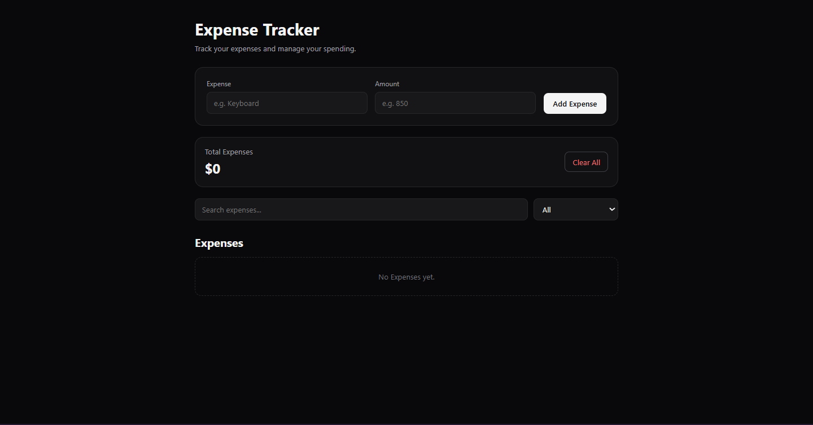

# 💰 Expense Tracker

A simple and modern **Expense Tracker** built with **HTML, CSS, and Vanilla JavaScript**.

The application allows users to add expenses, calculate total spending, search through expenses, sort them by amount, and persist their data using the browser's `localStorage`.

## 🌐 Live Demo

[View Live Demo](https://a-h-m-e-d-z-a-h-e-r.github.io/Expense-Tracker/)

## ✨ Features

* ➕ Add new expenses with a name and amount
* 💰 Automatically calculate total expenses
* 💾 Save expenses using `localStorage`
* 🔄 Restore saved expenses when the page is reopened
* 🔎 Search expenses by name
* 📊 Sort expenses by:
  * All
  * Highest amount
  * Lowest amount
* 🗑️ Clear all expenses
* ⚡ Automatically update the expense list
* 📱 Responsive layout
* 🎨 Modern dark interface

## 🛠️ Tech Stack

* **HTML5**
* **CSS3**
* **JavaScript (ES6+)**
* **LocalStorage**

## 💾 Data Persistence

Expense data is stored in the browser using the **LocalStorage API**.

The application saves the current expenses and restores them when the page is reopened, allowing the data to persist between browser sessions.

## 🔎 Search & Sorting

The application provides simple tools for managing larger expense lists.

### Search

Users can search for expenses by name. The list is dynamically filtered based on the entered search term.

### Sorting

Expenses can be displayed by:

* All expenses
* Highest amount
* Lowest amount

The original expense array is copied before sorting to avoid directly modifying the stored data.

## 🧩 Project Structure

```text
Expense-Tracker/
├── index.html
├── style.css
└── script.js
````

### Architecture

* **`index.html`** — Application structure, expense form, controls, summary, and expense list.
* **`style.css`** — Complete styling, dark interface, layout, and responsive design.
* **`script.js`** — Expense management, calculations, search, sorting, LocalStorage, and dynamic DOM rendering.

## 🧮 Expense Calculations

The total amount is calculated dynamically using JavaScript's `reduce()` method.

Whenever the expense list changes, the displayed total is recalculated to remain synchronized with the stored expenses.

## 🎨 Interface

The application uses a minimal dark interface with:

* Dark background
* Neutral borders
* Rounded cards and inputs
* Simple typography
* Clear visual hierarchy
* Responsive controls
* Maximum content width for comfortable viewing

## 📱 Responsive Design

The layout adapts to smaller screens.

On mobile devices:

* The expense form switches to a single-column layout
* Search and filter controls stack vertically
* The summary section becomes vertically aligned
* The add button uses the available width

## 🖼️ Screenshot

<p align="center">
  
</p>

## 🎯 Project Goal

This project was built as a practical JavaScript project to strengthen **DOM manipulation, event handling, arrays, objects, data persistence, dynamic rendering, and responsive UI development**.

The goal was to build a functional expense management application using vanilla JavaScript without external frameworks or libraries.

## 🧠 What I Practiced

* DOM selection
* Event listeners
* Functions
* Arrays and objects
* `push()`
* `filter()`
* `sort()`
* `reduce()`
* Spread syntax
* Template literals
* Type conversion
* JSON serialization
* LocalStorage
* Dynamic DOM rendering
* Responsive CSS

## 👨‍💻 Author

**Ahmed Zaher Abdelmohsen**

Frontend Developer focused on building modern, responsive, and user-friendly web experiences.

* Portfolio: `https://a-h-m-e-d-z-a-h-e-r.github.io/Portfolio/`
* GitHub: `https://github.com/A-H-M-E-D-Z-A-H-E-R`

---

⭐ If you found this project interesting, feel free to explore the repository.

